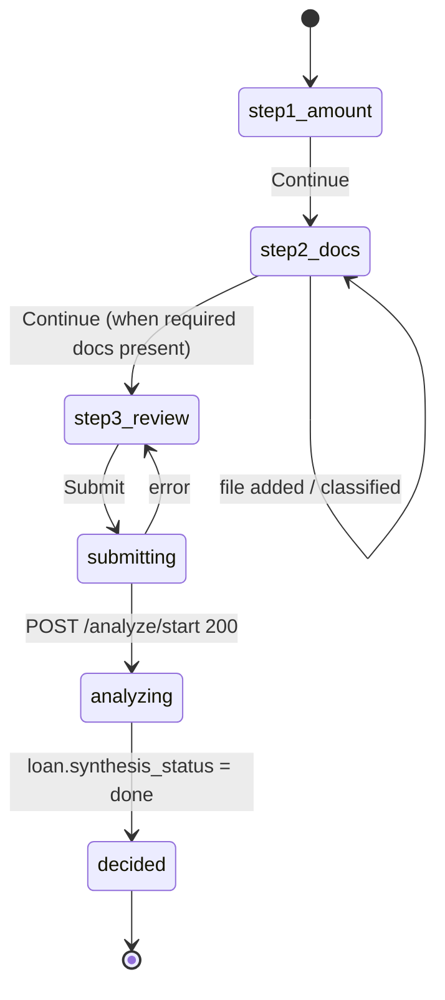
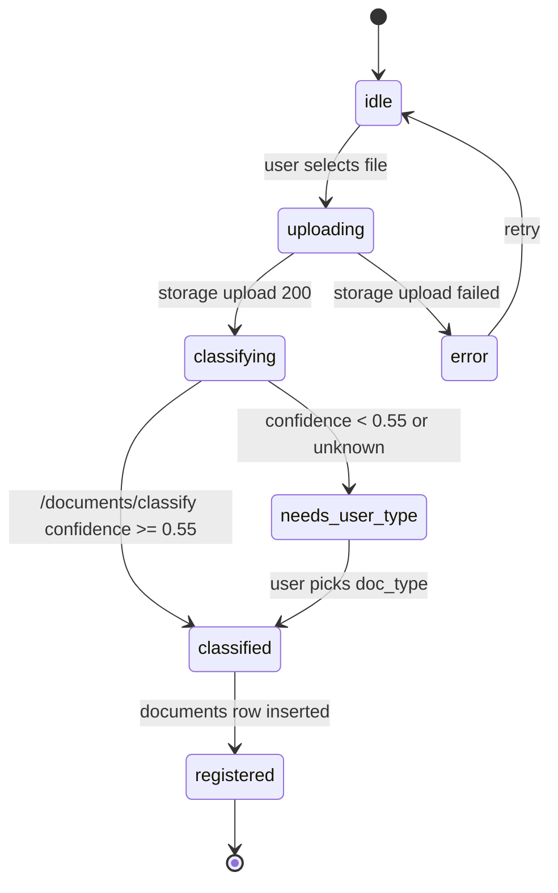
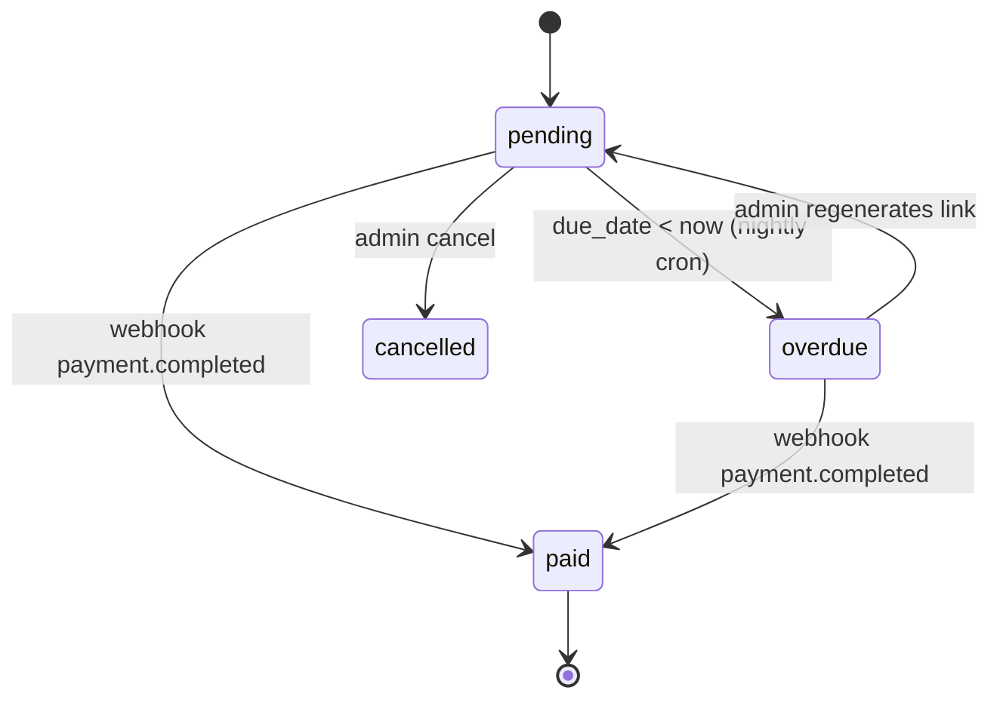
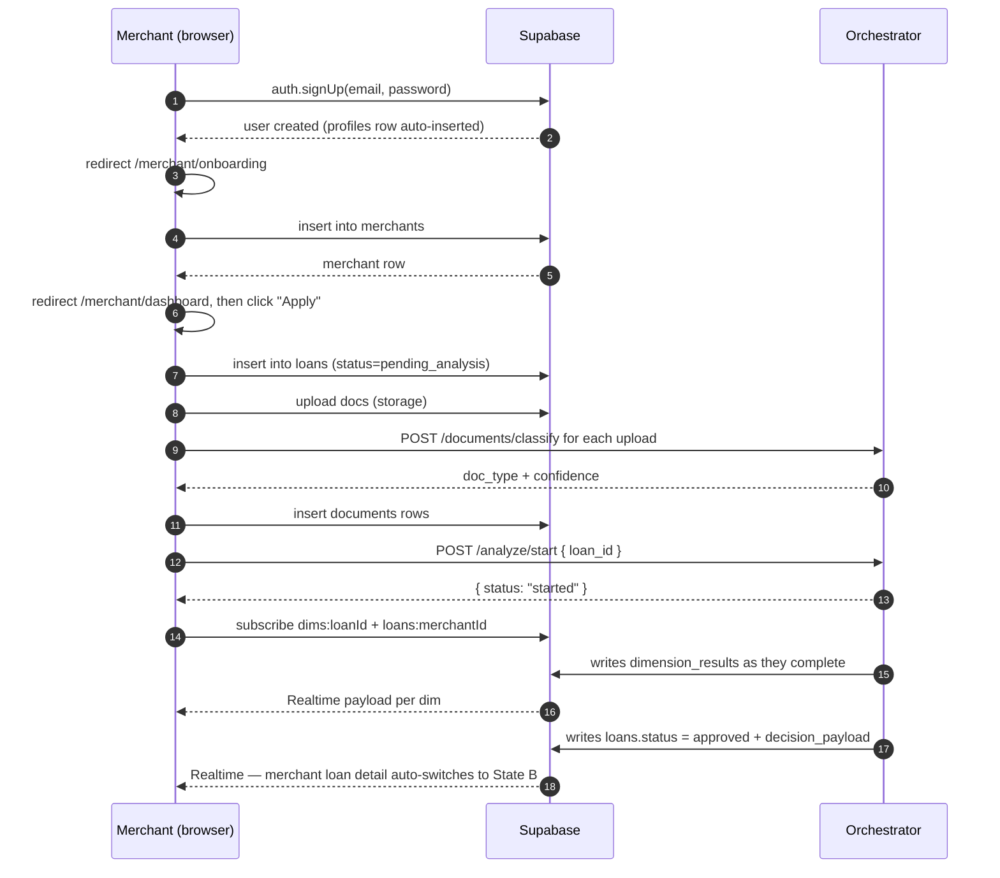
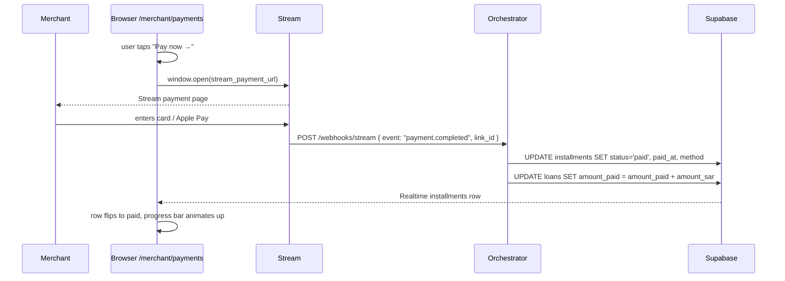
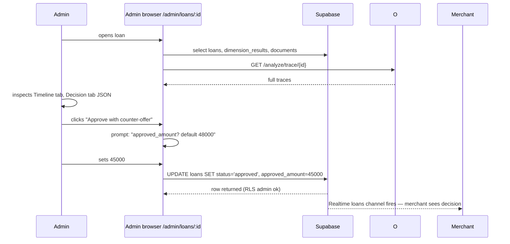

# LeaseFlow — Frontend Specification

> **Audience:** Stitch (designer) first, React implementer second.
> **Status:** v1 — hand-off ready.
> **Companion doc:** [`API_CONTRACT.md`](./API_CONTRACT.md). This spec does NOT re-document endpoints. Cross-reference everywhere you see `→ API_CONTRACT §...`.
> **Source of design truth:** `/Users/abdulrazzak/Desktop/protfolio/mockup.html`. Tokens + visual moves are quoted verbatim below.

---

## 1. Product summary

LeaseFlow is equipment financing for Saudi small merchants. A café owner in Riyadh wants to buy a SAR 50,000 espresso machine. He logs in, tells us what he wants, uploads a bank statement and an invoice, and within ~90 seconds gets an answer: **yes for SAR 48,000 at 12 monthly payments of SAR 4,792**, or **no** with a human reason, or **we're still checking** with a promise to email him. He never sees the word "DSCR".

Behind the merchant-facing screens there is an operator tool used by the LeaseFlow underwriting team to monitor live loans, pick apart the model's reasoning, set risk appetite, and manually override decisions. That's the Admin surface — colder, denser, darker. Two audiences, two products, one backend.

---

## 2. Design tokens

### 2.1 Merchant theme — `:root` (light / beige, used on `/`, `/login`, `/signup`, `/merchant/*`)

Copied verbatim from `/Users/abdulrazzak/Desktop/protfolio/mockup.html`:

```css
:root {
  --primary:      #FDC800;        /* brand yellow — constant across themes */
  --secondary:    #432DD7;        /* deep purple — accent / links */
  --success:      #16A34A;        /* paid, approved, healthy */
  --warning:      #D97706;        /* manual_review, marginal */
  --danger:       #DC2626;        /* denied, overdue */
  --surface:      #FBFBF9;        /* bone page background */
  --text:         #1C293C;        /* near-black slate */
  --muted:        #64748b;        /* secondary copy */
  --border:       #1C293C;        /* hard border = same as text */
  --shadow:       #1C293C;        /* offset shadow = same as text */
  --card-bg:      white;          /* elevated cards */
  --divider:      #e2e8f0;        /* hairline rules only */
  --font-primary: 'Inter', sans-serif;
  --font-mono:    'JetBrains Mono', monospace;
}
```

### 2.2 Admin theme — `[data-theme="dark"]` (used on `/admin/*`)

```css
[data-theme="dark"] {
  --primary:   #FDC800;  /* yellow stays constant */
  --secondary: #7B6BF6;  /* lighter purple for dark */
  --success:   #22C55E;
  --warning:   #FBBF24;
  --danger:    #F87171;
  --surface:   #0F0F0F;  /* near-black page */
  --text:      #E8E8E8;
  --muted:     #888888;
  --border:    #444444;  /* softer border on dark */
  --shadow:    #444444;  /* shadow is visible against page */
  --card-bg:   #1A1A1A;
  --divider:   #2A2A2A;
}
```

### 2.3 Theme application rule

**There is NO theme toggle.** Theme is set in a top-level React layout component keyed off `useLocation().pathname`:

```tsx
// app/layout.tsx
const isAdmin = pathname.startsWith("/admin");
useEffect(() => {
  if (isAdmin) document.documentElement.setAttribute("data-theme", "dark");
  else         document.documentElement.removeAttribute("data-theme");
}, [isAdmin]);
```

The `localStorage` logic in the portfolio mockup is deleted.

### 2.4 Tailwind mapping

Use Tailwind v4 `@theme` to alias CSS vars — do not hardcode hex anywhere:

```css
@theme {
  --color-primary:   var(--primary);
  --color-secondary: var(--secondary);
  --color-success:   var(--success);
  --color-warning:   var(--warning);
  --color-danger:    var(--danger);
  --color-surface:   var(--surface);
  --color-text:      var(--text);
  --color-muted:     var(--muted);
  --color-border:    var(--border);
  --color-card:      var(--card-bg);
  --font-sans:       var(--font-primary);
  --font-mono:       var(--font-mono);
}
```

### 2.5 Spacing scale — 8-point

| Token | px | Usage |
|-------|----|----|
| `space-1` | 4  | inline gap, pulse-dot padding |
| `space-2` | 8  | chip padding-y, icon gap |
| `space-3` | 12 | form field padding-y |
| `space-4` | 16 | card internal padding tight |
| `space-6` | 24 | card internal padding default |
| `space-8` | 32 | section internal gap |
| `space-12` | 48 | page gutter (desktop), section top margin |
| `space-16` | 64 | hero top padding, major section gap |
| `space-20` | 80 | between major sections |

Default page gutter: **48px desktop, 24px tablet, 16px mobile.**

### 2.6 Typography scale

| Role | Size | Weight | Family | Where |
|------|------|--------|--------|-------|
| Micro-label (section) | 13px / `letter-spacing:2px` / UPPERCASE | 600 | mono | above every section |
| Chip / status / code | 11–12px | 600 | mono | StatusChip, tags |
| Key-value pair | 13px | 400–600 | mono | terminal bodies, metadata |
| Body | 14–15px | 400 | Inter | paragraphs, descriptions |
| Emphasis body | 17px | 500–600 | Inter | hero tagline, form labels |
| Heading S | 21px | 800 | Inter | section titles |
| Heading M | 27px | 800 | Inter | card headlines |
| Heading L | 35px | 900 | Inter / mono numbers | page hero |
| Heading XL | 48px | 900 | Inter / mono numbers | landing hero |
| Display | 64px | 900 | Inter / mono numbers | landing only |

**All numbers that represent amounts, percentages, scores, counts, dates, or codes — JetBrains Mono. No exceptions.** Labels above sections — mono. Chips — mono. Everything narrative — Inter.

### 2.7 Border + shadow scale

- **Border width:** `3px` on cards, buttons, inputs, panels, chips. `2px` on hairline chips and divider rules only. Never 1px.
- **Border color:** `var(--border)` always. Never a color.
- **Border radius:** `0`. Everywhere. Chips, buttons, cards, inputs, images. Zero rounded corners in this product.
- **Shadow scale (offset, 0 blur):**
  - `3px 3px 0 var(--shadow)` — chips, nav pills
  - `4px 4px 0 var(--shadow)` — buttons, small cards
  - `6px 6px 0 var(--shadow)` — cards, panels
  - `8px 8px 0 var(--shadow)` — hero terminal window, featured cards
- **Never** `filter: blur`, `backdrop-filter`, or `rgba()` shadows.

### 2.8 Motion tokens

- Hover transition: `transform 0.08s, box-shadow 0.08s, background 0.12s`. Linear or `ease-out`. Never spring.
- Hover behavior: `translate(-2px, -2px)` + shadow grows by 2px. **Applied to every clickable card, button, and link.**
- Pulse: 2s infinite, `opacity: 1 → 0.4 → 1`.
- No parallax. No page-scroll animations. No number counters except decision reveal.

---

## 3. Design principles

### 3.1 Mandatory visual moves (both themes)

| # | Move | Example in our product |
|---|------|------------------------|
| 1 | Hard 3px borders, no radius | Every `DimCard`, `StatusChip`, `<Button>`, `<Input>` |
| 2 | No-blur offset shadow | Loan rows in dashboard table; 4px shadow, grows to 6px on hover |
| 3 | Hover = translate + shadow grow | Clicking a dim card: `translate(-2px,-2px) + shadow 6→8` |
| 4 | Yellow underline on ONE key word per page | Landing hero: "Financing that doesn't make you <u>wait</u>." |
| 5 | Terminal-window frame for "live" panels | `/merchant/loans/:id` analyzing state; `/admin/loans/:id` timeline |
| 6 | Mono uppercase micro-label with divider trailing right | `SELECTED WORK ────────` above every section on admin dashboard |
| 7 | Status dot with 2s pulse | "Analysis running · 42s" chip; "Live feed" on admin dashboard header |

### 3.2 Merchant persona UX principles

Our merchant is a 30-year-old café owner, fluent English, intelligent, impatient with jargon. Design rules:

| Principle | Example |
|-----------|---------|
| **One primary action per screen.** 48px tall, yellow bg, 3px border, 4px shadow. Only ONE yellow button visible at a time. | Dashboard → "Apply for new financing". Loan detail → "View repayment plan" (only when decided). |
| **Huge numbers.** Amounts at 35–64px, JetBrains Mono, weight 900. "SAR" prefix always visible, 14px mono. | Next payment card: `SAR` then `4,791.67` at 48px. |
| **Plain English.** Banned: "DSCR", "synthesis", "dimension score", "override_applied", "hard floor", "risk appetite". Every admin term has a merchant rewrite (§10.5). | "DSCR 2.3×" → "Can you afford this? **Yes, comfortably.**" |
| **"What happens next" line.** Muted 14px under every state screen. | After submit: "We're checking your documents. We'll email you at aj@aajil.ai in about a minute." |
| **Wait-UX is warm.** Terminal window + pulsing dot + "it's okay to close this page" line. No stuck spinner. | See §4.7 `/merchant/loans/:id` analyzing. |
| **Never expose admin jargon.** No model names, no trace IDs, no per-dim confidence decimals. | Merchant sees "Business trust: **Strong**", admin sees "simah score 70 · confidence 0.85". |

### 3.3 Admin persona UX principles

Admin is an internal underwriter. They need density, evidence, overrides.

- More than one primary action is OK. Buttons can be smaller (36px).
- Show numbers to decimals (`0.85`, not "Strong").
- Expose every audit field — model name, trace duration, raw prompt on click.
- Use purple `var(--secondary)` for links and secondary CTAs in dark mode (`#7B6BF6`).
- Data-dense tables with mono columns are default. Cards are rare.

---

## 4. View inventory — 13 views

Every route listed with: **role · theme · one-line purpose · hero · ASCII wireframe · data sources · states · copy**.

---

### 4.1 `/` — landing

- **Role:** public · **Theme:** BEIGE
- **Purpose:** sell the product to a stranger in 10 seconds, drive to `/signup`.
- **Hero:** headline with yellow-underlined word "wait" + terminal window showing live decision sample.

```
┌─ [LOGO] LeaseFlow ────────────── [Log in] [Sign up] ──┐
│                                                        │
│  FINANCING                 ┌──────────────────────────┐│
│  THAT DOESN'T              │ ● ● ●   ~/decision.json ││
│  MAKE YOU [wait].          │──────────────────────────││
│                            │ "status":    "approved"  ││
│  A straight answer on      │ "amount":    "SAR 48,000"││
│  equipment financing,      │ "monthly":   "SAR 4,792" ││
│  in under two minutes.     │ "decided_in":"87 seconds"││
│                            └──────────────────────────┘│
│  [ Apply now → ]           (yellow hard-shadow button) │
│                                                        │
│  HOW IT WORKS ──────────────────────────────────────── │
│  [01 Upload docs] [02 We read them] [03 You get $]     │
└────────────────────────────────────────────────────────┘
```

- **Data sources:** none. Static marketing.
- **States:** only default.
- **Copy:**
  - H1: "Financing that doesn't make you <u>wait</u>."
  - Tagline: "A straight answer on equipment financing for your business, in under two minutes."
  - CTA: "Apply now →"
  - Step labels: "01 / Upload your docs" · "02 / We read them in seconds" · "03 / You get a decision"

---

### 4.2 `/login`

- **Role:** public · **Theme:** BEIGE
- **Purpose:** Supabase email+password sign-in, route by role after login.
- **Hero:** minimal form card, dead center.

```
┌──────────────────────────────────────────┐
│  [LOGO]                                  │
│                                          │
│      ┌──────────────────────────┐        │
│      │ ● ● ●  ~/login.sh        │        │
│      │──────────────────────────│        │
│      │                          │        │
│      │  WELCOME BACK ───────    │        │
│      │                          │        │
│      │  Email                   │        │
│      │  [________________]      │        │
│      │                          │        │
│      │  Password                │        │
│      │  [________________]      │        │
│      │                          │        │
│      │  [  Log in →  ]          │        │
│      │                          │        │
│      │  No account? Sign up     │        │
│      └──────────────────────────┘        │
└──────────────────────────────────────────┘
```

- **Data sources:** `supabase.auth.signInWithPassword`, then `from("profiles").select("role").single()` → redirect `/merchant/dashboard` or `/admin`.
- **States:**
  - idle / submitting (button shows spinner-dot) / error (red 3px border on field + message)
  - lockout / invalid_credentials → "That email and password don't match. Try again."
- **Copy strings:**
  - `invalid_credentials`: "That email and password don't match. Try again."
  - `network`: "We can't reach our servers. Check your connection."

---

### 4.3 `/signup`

- **Role:** public · **Theme:** BEIGE
- **Purpose:** merchant registration. 3 fields. Creates auth user + `profiles` row (trigger).
- **Hero:** same terminal-window frame as `/login`.

```
┌─ ● ● ●   ~/signup.sh ─────────────┐
│ GET STARTED ─────────────────────  │
│                                    │
│ Business name                      │
│ [_______________________]          │
│                                    │
│ Email                              │
│ [_______________________]          │
│                                    │
│ Password (8+ characters)           │
│ [_______________________]          │
│                                    │
│ [  Create account →  ]             │
│                                    │
│ Already have one? Log in           │
└────────────────────────────────────┘
```

- **Data sources:** `supabase.auth.signUp({ email, password, options: { data: { display_name: business_name } } })`.
- **After signup:** redirect to `/merchant/onboarding` (merchants must create a `merchants` row on first run).
- **States:** idle / submitting / error (`email_in_use`, `weak_password`).
- **Copy:**
  - `email_in_use`: "That email already has an account. Log in instead."
  - `weak_password`: "Use at least 8 characters."

---

### 4.4 `/merchant/onboarding`

- **Role:** merchant · **Theme:** BEIGE
- **Purpose:** one-time setup — create `merchants` row. Required before any loans.
- **Hero:** "Tell us about your business" + 4 fields.

```
┌─ Step 1 of 1 · About your business ───────────────────┐
│                                                        │
│ BUSINESS DETAILS ──────────────────────────────────    │
│                                                        │
│ Business name      [ Qahwa Haneen              ]       │
│ Commercial reg #   [ 1010XXXXXX                ]       │
│ Google Maps link   [ https://maps.app.goo.gl... ]      │
│ Phone              [ +966 55 ...               ]       │
│                                                        │
│ WHY WE ASK ─────────────────────────────────────       │
│ We use your CR number to check SIMAH, and your Google  │
│ Maps link to read what your customers say. Takes us    │
│ about a minute per application.                        │
│                                                        │
│ [  Continue →  ]                                       │
└────────────────────────────────────────────────────────┘
```

- **Data sources:** `supabase.from("merchants").insert({ business_name, cr_number, google_maps_url, phone })`. On success → `/merchant/dashboard`.
- **States:** idle / submitting / error. CR number format check: 10 digits, all numeric.
- **Copy:**
  - Header: "Welcome. Let's set up your business."
  - Empty CR error: "Your commercial registration number is 10 digits. You can find it on your CR certificate."

---

### 4.5 `/merchant/dashboard`

- **Role:** merchant · **Theme:** BEIGE
- **Purpose:** landing page after login. Shows next payment (if any), active loans, one big CTA.
- **Hero:** `BigNumberCard` showing "Next payment in X days · SAR Y" OR "No active financing yet".

```
┌─ Nav: [LeaseFlow]  Dashboard · Payments · Profile · [Logout] ─┐
│                                                                │
│ Hi, Ahmed.                                                     │
│                                                                │
│ ┌───────────────────────────────────┐  ┌─────────────────────┐ │
│ │ NEXT PAYMENT ──────────           │  │ [+ Apply for new    │ │
│ │                                   │  │   financing →]      │ │
│ │ SAR                               │  │                     │ │
│ │ 4,791.67                          │  │ yellow 48px button  │ │
│ │                                   │  │ 4px shadow          │ │
│ │ ● due in 8 days (May 16)          │  └─────────────────────┘ │
│ │                                   │                          │
│ │ [  Pay now →  ]                   │                          │
│ └───────────────────────────────────┘                          │
│                                                                │
│ YOUR FINANCING ─────────────────────────────────────────────   │
│ ┌─ La Marzocco GB5 · SAR 48,000 ──────────────── approved ──┐  │
│ │  ▓▓▓▓▓▓▓▓░░░░░░░░  4 of 12 paid · SAR 28,750 remaining    │  │
│ │                                                            │  │
│ │  View details →                                            │  │
│ └────────────────────────────────────────────────────────────┘  │
│ ┌─ Deli oven · SAR 32,000 · submitted 2 min ago ──analyzing─┐  │
│ │  ● We're checking your documents. ETA ~40s.                │  │
│ └────────────────────────────────────────────────────────────┘  │
└────────────────────────────────────────────────────────────────┘
```

- **Data sources:**
  - `supabase.from("installments").select("*, loans!inner(item_description)").eq("status","pending").order("due_date").limit(1)` → NEXT_PAYMENT hero
  - `supabase.from("loans").select("*").eq("merchant_id", me.id).order("created_at", {ascending:false})` → loan rows
  - Realtime: channel `loans:${merchantId}` (→ API_CONTRACT §Realtime).
- **States:**
  - Empty (no loans): CTA card becomes full-width. "You haven't applied for financing yet. It takes about 3 minutes."
  - Loading: skeleton BigNumberCard with shimmering 3px-border placeholder.
  - Error: terminal-window "error.log" frame with retry button.
- **Copy:**
  - Hello: "Hi, {first_name}."
  - No-payment: "No upcoming payments. You're all caught up."
  - No-loans: "You haven't applied for financing yet. It takes about 3 minutes."
  - CTA: "Apply for new financing →"

---

### 4.6 `/merchant/new-loan` — 3-step wizard

- **Role:** merchant · **Theme:** BEIGE
- **Purpose:** capture `loans` row + upload docs + call `/analyze/start`.
- **Hero:** step indicator "Step 1 / 3" mono, with the active step's title big.

#### Step 1 — What do you need?

```
┌─ STEP 1 OF 3 · What do you need? ─────────────────────┐
│                                                        │
│ How much?                                              │
│ ┌──────────────────────────┐                           │
│ │ SAR    50,000            │ ← 48px mono number input  │
│ └──────────────────────────┘                           │
│                                                        │
│ What's it for?                                         │
│ ┌──────────────────────────────────────────────────┐   │
│ │ La Marzocco GB5 espresso machine                 │   │
│ └──────────────────────────────────────────────────┘   │
│                                                        │
│ Pay back over                                          │
│ ( ) 6 months  (•) 12 months  ( ) 18 months             │
│                                                        │
│ WHAT YOU'D PAY ─────────────────────────────────       │
│ About SAR 4,791 / month for 12 months                  │
│                                                        │
│ [  Continue →  ]                                       │
└────────────────────────────────────────────────────────┘
```

#### Step 2 — Upload documents

```
┌─ STEP 2 OF 3 · Upload your documents ─────────────────┐
│ NEED FROM YOU ─────────────────────────────────────    │
│ ✓ An invoice (what you're buying)                      │
│ ✓ A bank statement (last 6 months)                     │
│                                                        │
│ OPTIONAL (better answer) ──────────────────────────    │
│ ○ Financial statement (last year)                      │
│ ○ POS export (last 90 days)                            │
│                                                        │
│ ┌─ Drop files here, or click to pick ──────────────┐   │
│ │                                                  │   │
│ │          [ 📎 Click to choose files ]            │   │
│ │                                                  │   │
│ └──────────────────────────────────────────────────┘   │
│                                                        │
│ UPLOADED ───────────────────────────────────────────   │
│ [ ✓ bank_statement.pdf · Bank statement · 95% sure ]   │
│ [ ✓ invoice_marzocco.pdf · Invoice · 97% sure    ]     │
│                                                        │
│ READY TO SUBMIT: 2 of 2 required                       │
│                                                        │
│ [ ← Back ]              [  Continue →  ]               │
└────────────────────────────────────────────────────────┘
```

#### Step 3 — Review & submit

```
┌─ STEP 3 OF 3 · Review ────────────────────────────────┐
│                                                        │
│ YOU'RE ASKING FOR ─────────────────────────────────    │
│ SAR 50,000                                             │
│ for La Marzocco GB5 espresso machine                   │
│ paid back over 12 months                               │
│                                                        │
│ DOCUMENTS ────────────────────────────────────────     │
│ • bank_statement.pdf                                   │
│ • invoice_marzocco.pdf                                 │
│                                                        │
│ WHAT HAPPENS NEXT ─────────────────────────────────    │
│ We'll read your documents and check a few things about │
│ your business. Takes about a minute. We'll email you   │
│ at ahmed@qahwa.sa the moment we have an answer.        │
│                                                        │
│ [ ← Back ]           [  Submit application →  ]        │
└────────────────────────────────────────────────────────┘
```

- **Data sources:**
  - Step 1: client state only.
  - Step 2: `supabase.storage.from("loan-documents").upload(...)` → `POST /documents/classify` → `supabase.from("documents").insert(...)`. (→ API_CONTRACT §Storage, §`/documents/classify`.)
  - Step 3 submit: `supabase.from("loans").insert(...)` → `POST /analyze/start` → navigate to `/merchant/loans/:id`.
- **States:**
  - Per-upload: `idle → uploading → classifying → classified → needs_user_type (if confidence<0.55) → registered`.
  - Submit disabled until `invoice` + (`bank_statement` OR `financial_statement`) present.
- **Copy:**
  - "You're asking for {amount}. Here's how we'll check it works for you."
  - Submit CTA: "Submit application →"
  - Error submit: "Something went wrong on our side. Try again, or email support@leaseflow.sa."

---

### 4.7 `/merchant/loans/:id` — TWO STATES

- **Role:** merchant · **Theme:** BEIGE
- **Purpose:** show analysis in flight, then the decision + next actions.

#### State A — ANALYZING (while `loan.status ∈ {pending_analysis, analyzing}`)

Warm, reassuring wait-UX. Terminal-window-framed. Auto-updates via Realtime.

```
┌───────────────────────────────────────────────────────────┐
│                                                           │
│  WE'RE CHECKING YOUR APPLICATION                          │
│                                                           │
│  ┌─ ● ● ●   ~/analysis.log ─────────────────────── 42s ─┐ │
│  │                                                       │ │
│  │ ● Reading bank_statement.pdf                done      │ │
│  │ ● Reading invoice_marzocco.pdf              done      │ │
│  │ ● Checking if you can afford it             running   │ │
│  │ ● Checking your business on Google          running   │ │
│  │ ● Checking your credit                      queued    │ │
│  │ ● Looking at your industry                  queued    │ │
│  │                                                       │ │
│  └───────────────────────────────────────────────────────┘ │
│                                                           │
│  It's okay to close this page. We'll email you at         │
│  ahmed@qahwa.sa the moment we have an answer.             │
│                                                           │
└───────────────────────────────────────────────────────────┘
```

#### State B — DECIDED (`loan.status ∈ {approved, denied, manual_review}`)

```
┌─ La Marzocco GB5 · applied Apr 16 ────────────────────┐
│                                                        │
│   ✓  APPROVED                                          │
│                                                        │
│   SAR 48,000                                           │
│   over 12 months                                       │
│   SAR 4,791.67 per month                               │
│                                                        │
│ WHY ─────────────────────────────────────────────────  │
│ You have steady monthly sales and good reviews. We're  │
│ comfortable this payment fits your cash flow.          │
│                                                        │
│ HOW WE CHECKED ──────────────────────────────────────  │
│ Can afford this         ▓▓▓▓▓▓▓▓▓▓ Strong              │
│ Business trust          ▓▓▓▓▓▓▓░░░ Good                │
│ Sales health            ▓▓▓▓▓▓▓▓░░ Strong              │
│ Customer reviews        ▓▓▓▓▓▓▓▓▓░ Strong              │
│ Industry outlook        ▓▓▓▓▓▓░░░░ Fair                │
│                                                        │
│ [  View repayment plan →  ]                            │
└────────────────────────────────────────────────────────┘
```

Denied / manual_review variants: same frame, `DecisionCard` swaps color (red / amber) and headline. Manual_review never shows the dim bars — it shows the warm "we're double-checking" copy.

- **Data sources:**
  - `supabase.from("loans").select("*").eq("id", id).single()`
  - `supabase.from("dimension_results").select("*").eq("loan_id", id)` (for the simplified bars)
  - Realtime: channel `dims:${loanId}` and `loans:${merchantId}` filtered on this id.
  - Fallback: `GET /analyze/status/{id}` every 10s if websocket drops (→ API_CONTRACT §`/analyze/status`).
- **Copy:**
  - State A header: "We're checking your application"
  - Reassurance line: "It's okay to close this page. We'll email you at {email}."
  - Approved header: "✓ APPROVED"
  - Denied header: "✕ NOT THIS TIME"
  - Manual_review: "● We're double-checking your application. Usually 1 business day."
  - Why-block = `decision_payload.llm_response.reasoning`, rewritten to strip jargon client-side.

---

### 4.8 `/merchant/payments`

- **Role:** merchant · **Theme:** BEIGE
- **Purpose:** see all installments across all loans, pay the next due one.
- **Hero:** `BigNumberCard` with next due.

```
┌─ Payments ────────────────────────────────────────────┐
│                                                        │
│ NEXT UP ───────────────────────────────────            │
│ SAR 4,791.67  ·  due in 8 days  ·  May 16              │
│ [  Pay now →  ]                                        │
│                                                        │
│ LA MARZOCCO GB5 · 4 OF 12 PAID ──────────────────      │
│ Progress: ▓▓▓▓▓▓▓▓░░░░░░░░░░░░░░ 33%                   │
│                                                        │
│ ●──●──●──●──○──○──○──○──○──○──○──○                     │
│ paid paid paid paid ⬆next                              │
│                                                        │
│ UPCOMING INSTALLMENTS ──────────────────────────────   │
│ #5   May 16, 2026   SAR 4,791.67   pending  [Pay]      │
│ #6   Jun 16, 2026   SAR 4,791.67   pending             │
│ #7   Jul 16, 2026   SAR 4,791.67   pending             │
│ ...                                                    │
│                                                        │
│ PAID ─────────────────────────────────────────────     │
│ #4   Apr 16, 2026   SAR 4,791.67   paid · mada         │
│ ...                                                    │
└────────────────────────────────────────────────────────┘
```

- **Data sources:**
  - `supabase.from("installments").select("*, loans!inner(*)").order("due_date")`
  - Realtime: channel `installments:${merchantId}` filtered on owned loans.
- **States:**
  - Empty (no loan approved yet): "You don't have any repayments scheduled. Come back once your financing is approved."
  - Payment link expired: `PaymentLinkButton` disables, tooltip "Link expired. Tap refresh to get a new one." (admin has endpoint; merchant sees "Contact support" if regen fails.)
- **Copy:**
  - Next-up CTA: "Pay now →"
  - Paid-all: "🎉 You've paid off this machine. We hope it's paying you back."

---

### 4.9 `/merchant/profile`

- **Role:** merchant · **Theme:** BEIGE
- **Purpose:** edit `merchants` row fields. Show account email (read-only).

```
┌─ Profile ─────────────────────────────────────────────┐
│                                                        │
│ SIGN-IN ──────────────────────────────────────        │
│ ahmed@qahwa.sa   (contact support to change)           │
│                                                        │
│ YOUR BUSINESS ────────────────────────────────        │
│ Business name     [ Qahwa Haneen              ]        │
│ CR number         [ 1010XXXXXX                ]        │
│ Google Maps link  [ https://maps.app.goo.gl/... ]      │
│ Phone             [ +966 55 ...               ]        │
│                                                        │
│ [  Save changes  ]                                     │
│                                                        │
│ ──────────────────────────────────────────────        │
│ Log out                                                │
└────────────────────────────────────────────────────────┘
```

- **Data sources:** `supabase.from("merchants").select("*").single()`, update via `.update().eq("id", me.id)`.
- **States:** idle / saving / saved (toast) / error.

---

### 4.10 `/admin` — live loan feed

- **Role:** admin · **Theme:** DARK
- **Purpose:** operator dashboard. Live Realtime feed of all loans, decision mix donut, risk banner.
- **Hero:** `RiskBanner` at top spanning full width.

```
┌─ Nav: [LF] Loans · Risk · Segments · [admin@leaseflow] ──────────┐
│                                                                  │
│ ┌─ RISK APPETITE ─ ● cautious ─ updated 2h ago ────────────────┐ │
│ │ max_ticket: SAR 75,000 · min_dscr: 1.5 · deny_floor: 55     │ │
│ └──────────────────────────────────────────────────────────────┘ │
│                                                                  │
│ ┌─ DECISION MIX (24h) ──────┐  ┌─ LIVE FEED ● 3 running ─────┐   │
│ │      ╭──────╮             │  │ • 12:42:03  Qahwa Haneen    │   │
│ │     ╱  55%  ╲             │  │             analyzing · 41s │   │
│ │    │approved │            │  │ • 12:38:21  Deli King       │   │
│ │     ╲      ╱              │  │             approved · 87s  │   │
│ │      ╰──────╯             │  │ • 12:31:14  Mr Laban        │   │
│ │   30% denied  15% manual  │  │             denied · 92s    │   │
│ └───────────────────────────┘  └─────────────────────────────┘   │
│                                                                  │
│ ALL LOANS ───────────────────────────────────────────────────    │
│ ┌────────────────────────────────────────────────────────────┐   │
│ │ merchant    │ amount   │ status     │ score │ decided in  │   │
│ │ Qahwa Han.. │ 50,000   │ ● analyzing│ --    │ 41s ...     │   │
│ │ Deli King   │ 32,000   │ ✓ approved │ 78    │ 87s         │   │
│ │ Mr Laban    │ 80,000   │ ✕ denied   │ 42    │ 92s         │   │
│ │ Bayt Noor   │ 25,000   │ ⚠ manual   │ 61    │ 61s         │   │
│ └────────────────────────────────────────────────────────────┘   │
└──────────────────────────────────────────────────────────────────┘
```

- **Data sources:**
  - `supabase.from("loans").select("*, merchants(business_name)").order("created_at", {ascending:false}).limit(100)`
  - `GET /risk/current` → banner
  - `supabase.from("loans").select("status").gte("created_at", "24h ago")` → donut
  - Realtime: `loans` channel, no filter.
- **States:**
  - Empty: "No loans yet. When merchants apply, they'll show up here in real time."
  - Loading: skeleton rows with pulsing dots.

---

### 4.11 `/admin/loans/:id` — 4 tabs

- **Role:** admin · **Theme:** DARK
- **Purpose:** deep-dive on a single loan. Override, inspect traces, approve with counter-offer.
- **Tabs:** `Overview` / `Documents` / `Decision` / `Timeline`.

```
┌─ ← All loans · Qahwa Haneen · loan_id d7da39 ─────── [approve] [deny] ──┐
│                                                                          │
│ [ Overview ] Documents   Decision   Timeline                             │
│ ────────────                                                             │
│                                                                          │
│ ┌─ APPLICATION ──────────┐  ┌─ 5-DIM RADAR ────────────┐                 │
│ │ amount: 50,000 SAR     │  │                          │                 │
│ │ item:   La Marzocco    │  │        ╱│╲                │                 │
│ │ term:   12 months      │  │       ╱ │ ╲               │                 │
│ │ dscr:   2.3×           │  │      ●──┼──●              │                 │
│ │ monthly: 4,791.67      │  │       ╲ │ ╱               │                 │
│ │ decided in 87s         │  │        ╲│╱                │                 │
│ └────────────────────────┘  └──────────────────────────┘                 │
│                                                                          │
│ DIMENSIONS ──────────────────────────────────────────────────            │
│ ┌ pos  ─ 74 ─┐  ┌ financial ─ 80 ┐  ┌ simah ─ 70 ┐                       │
│ │ done · 0.85│  │ done · 0.92    │  │ done · 1.0 │                       │
│ │ stable rev.│  │ DSCR 2.3x comf │  │ score 710  │                       │
│ └────────────┘  └────────────────┘  └────────────┘                       │
│ ┌ sentim ─ 81┐  ┌ industry ─ 62  ┐                                       │
│ │ 4.4★ · 312 │  │ specialty cof..│                                       │
│ └────────────┘  └────────────────┘                                       │
└──────────────────────────────────────────────────────────────────────────┘
```

**Documents tab:**

```
┌─ Documents (4) ─────────────────────────────────────────┐
│ bank_statement.pdf       ▓▓▓▓▓▓▓▓▓▓ 0.95  [view json]   │
│ financial_statement.pdf  ▓▓▓▓▓▓▓▓▓░ 0.88  [view json]   │
│ pos_export.csv           ▓▓▓▓▓▓▓▓░░ 0.80  [view json]   │
│ invoice_marzocco.pdf     ▓▓▓▓▓▓▓▓▓▓ 0.97  [view json]   │
│                                                          │
│ Click a row → opens terminal-window drawer with the full │
│ `analysis_report` JSON + "open source PDF" link.         │
└──────────────────────────────────────────────────────────┘
```

**Decision tab:** shows `decision_payload` tree — `deterministic_proposal`, `hard_floors_check`, `llm_response`, `final_decision` as collapsible terminal-style JSON blocks. Big badge at top = `final_decision.status` + `override_applied`.

**Timeline tab:** the long-form `TraceTimelineRow` list. See §5 chart #2 for the "decided in 87s" headline bar.

- **Data sources:**
  - `supabase.from("loans").select("*, merchants(*)").eq("id", id).single()`
  - `supabase.from("dimension_results").select("*").eq("loan_id", id)`
  - `supabase.from("documents").select("*").eq("loan_id", id)`
  - `GET /analyze/trace/{id}` (→ API_CONTRACT §`/analyze/trace`)
  - Realtime: dims + loan.
- **Actions:** admin approve/deny = `supabase.from("loans").update({status, approved_amount}).eq("id", id)` (RLS enforces admin-only write).

---

### 4.12 `/admin/risk`

- **Role:** admin · **Theme:** DARK
- **Purpose:** set risk appetite, view historical risk snapshots.

```
┌─ Risk ─────────────────────────────────────────────────┐
│                                                         │
│ CURRENT APPETITE ─────────────────────────────────      │
│ ● cautious                                              │
│ max_ticket  75,000 SAR                                  │
│ min_dscr    1.5                                         │
│ deny_floor  55                                          │
│                                                         │
│ [ Edit policy ]  [ Force new snapshot ]                 │
│                                                         │
│ EXPOSURE (last 30 snapshots) ────────────────────────   │
│ ┌────────────────────────────────────────────────────┐  │
│ │  ● ─●─ ●── ●─ ●─ ●─────●──●─ ●  [yellow line chart]│  │
│ │                                                    │  │
│ └────────────────────────────────────────────────────┘  │
│ Total outstanding: SAR 1,240,000 · 23 active loans      │
│                                                         │
└─────────────────────────────────────────────────────────┘
```

- **Data sources:** `GET /risk/current`, `supabase.from("risk_snapshots").select("*").order("created_at", {ascending:false}).limit(30)`.
- **Actions:** `POST /risk/snapshot`; edit policy via PATCH on `risk_policies` row (admin RLS).

---

### 4.13 `/admin/segments`

- **Role:** admin · **Theme:** DARK
- **Purpose:** view the `segments` benchmark table; edit inline (admin RLS).

```
┌─ Segments ─────────────────────────────────────────────┐
│ segment          │ monthly_rev │ volatility │ margin   │
│ specialty_coffee │ 42,000      │ 0.18       │ 0.52     │
│ shawarma_qsr     │ 65,000      │ 0.22       │ 0.45     │
│ ...                                                     │
│                                                         │
│ Click row → edit-in-place.                              │
└─────────────────────────────────────────────────────────┘
```

- **Data sources:** `supabase.from("segments").select("*")`.

---

## 5. Charts + data visualizations

Every chart specified exhaustively. Library rule:

- **Recharts** → data charts that scale (line, bar, donut when values vary and must tooltip).
- **Bespoke inline SVG** → neo-brutalist visuals with hard strokes, radar, timeline, small-multiples.
- **CSS-only** → progress bars, horizontal bar meters (no values-on-hover needed).

All charts share these neo-brutalist rules: **no rounded line caps** (`stroke-linecap="butt"`), **no gradients**, **flat palette**, **3px strokes**, **black outline on fills**, **mono axis labels 11px**, **hard offset shadow on the container (6px)**. Axes are drawn with a 3px solid line, ticks are 2px solid, no grid.

---

### 5.1 5-Dimension Score Radar

- **Where:** `/admin/loans/:id` Overview tab.
- **Type:** bespoke inline SVG radar/pentagon.
- **Spokes (5):** Can afford · Business trust · Sales health · Customer reviews · Industry outlook (merchant labels); admin sees raw: financial_docs · simah · pos · sentiment · industry.
- **Dataset:**
  ```ts
  type RadarData = {
    dimension: "financial_docs" | "simah" | "pos" | "sentiment" | "industry";
    score: number; // 0–100
    confidence: number; // 0–1, drives opacity
  }[];
  ```
- **Styling:** yellow `var(--primary)` fill at 60% opacity, 3px `var(--border)` stroke, black vertices (6px circles, 2px border). Axis rings at 20/40/60/80/100 as 1px `var(--divider)` lines. Labels mono 11px, placed outside the pentagon.
- **Empty:** pentagon drawn at 0, all axes visible, centered text "waiting for analysis".
- **Merchant variant (on `/merchant/loans/:id` State B):** **NOT a radar.** Five labelled horizontal CSS bars (see §5.9 style).

---

### 5.2 Pipeline Timing Breakdown

- **Where:** `/admin/loans/:id` Timeline tab (top).
- **Type:** horizontal stacked bar, bespoke SVG.
- **Headline above chart:** `decided in 87s` at 48px mono weight 900.
- **Segments:** `extraction` / `dim_analysis` / `synthesis` — durations computed from `ai_traces.duration_ms` grouped by `kind`.
- **Dataset:**
  ```ts
  type TimingSegments = {
    phase: "extraction" | "dim_analysis" | "synthesis";
    duration_ms: number;
    color: string; // primary / secondary / success
  }[];
  ```
- **Styling:** 48px tall bar, 3px black outline, 3px vertical dividers between segments. Each segment labelled inside if >20% width, otherwise below. Labels: `extraction · 42.3s`, mono 11px.
- **Empty:** "no traces yet".

---

### 5.3 Repayment Progress

- **Where:** `/merchant/dashboard` loan rows, `/merchant/loans/:id` State B, `/merchant/payments`.
- **Type:** CSS-only horizontal progress bar.
- **Dataset:** `{ paid: number, total: number }`.
- **Styling:** 12px tall, 3px `var(--border)` outline, fill `var(--success)` for paid portion. Label right: `4 of 12 paid · SAR 28,750 remaining`, mono 13px.
- **Empty:** bar at 0%, label "starting soon".

---

### 5.4 Installments Timeline

- **Where:** `/merchant/payments`, `/merchant/loans/:id` State B (below decision).
- **Type:** bespoke inline SVG.
- **Nodes:** one per installment. 14px circle, 3px border.
- **Node states:**
  - `paid` → filled `var(--success)`
  - `pending` → filled `var(--card-bg)`, 3px border
  - `pending + next-up` → filled yellow `var(--primary)` with pulse
  - `overdue` → filled `var(--danger)`
- **Connector:** 3px horizontal line between nodes; `var(--border)` color.
- **Dataset:**
  ```ts
  type Installment = {
    installment_number: number;
    due_date: string;  // ISO
    status: "paid" | "pending" | "overdue" | "cancelled";
    amount_sar: number;
    is_next_due: boolean;
  };
  ```
- **Empty:** single placeholder node "no payments yet".

---

### 5.5 Portfolio Exposure Sparkline

- **Where:** `/admin/risk`.
- **Type:** Recharts `<LineChart>`, customized heavily.
- **Dataset:**
  ```ts
  type ExposurePoint = { created_at: string; total_exposure_sar: number };
  type ExposureSeries = ExposurePoint[];
  ```
- **Styling:** 3px stroke `var(--primary)`, `strokeLinecap="butt"`, no dot smoothing, `<Dot>` renders 6px black-filled circles with 2px yellow outline on every data point. X axis: mono 11px, last 5 ticks only. Y axis: mono, SAR abbrev ("1.24M"). No grid. Container 6px hard shadow.
- **Empty:** flat line at 0, "no snapshots yet — POST /risk/snapshot to create one".

---

### 5.6 Decision Mix Donut

- **Where:** `/admin` dashboard.
- **Type:** Recharts `<PieChart>` with `innerRadius=30%`.
- **Dataset:**
  ```ts
  type DecisionMix = { approved: number; denied: number; manual_review: number };
  ```
- **Styling:** 3 segments — `approved=var(--success)`, `denied=var(--danger)`, `manual_review=var(--warning)`. Each arc has 3px `var(--border)` stroke. Labels outside mono 13px "55% approved". Hard shadow 6px on the chart container. No tooltip (labels permanent).
- **Empty:** grey ring, "no decisions in the last 24h".

---

### 5.7 Extraction Confidence Bars

- **Where:** `/admin/loans/:id` Documents tab.
- **Type:** CSS-only horizontal bars, one per document.
- **Dataset:**
  ```ts
  type DocConfidence = {
    document_id: string;
    doc_type: DocType;
    filename: string;
    confidence: number; // 0-1
  };
  ```
- **Styling:** bar fill color by confidence band:
  - ≥ 0.90 → `var(--success)`
  - 0.70–0.89 → `var(--primary)`
  - < 0.70 → `var(--warning)`
  - missing → `var(--danger)` + "(failed)" label
- 3px border, 12px tall, mono label right: `0.95`.
- **Empty:** "no documents uploaded".

---

### 5.8 Decision Mix Small-Multiples (per-loan mini 5-bar)

- **Where:** `/admin` dashboard, inside each row of the loan table (right-most column).
- **Type:** bespoke inline SVG — 5 micro vertical bars, each 4px wide × up to 20px tall, 2px black outline.
- **Dataset:** `{ pos, financial, simah, sentiment, industry }: number[]`.
- **Styling:** bar fill = yellow if score ≥ 70, muted grey if 40–69, red if <40. No labels — hover tooltip shows dim name + score.
- **Empty:** 5 grey stubs at height 0.

---

### 5.9 Next Payment Big Card (NOT a chart, but a hero component)

- **Where:** `/merchant/dashboard`, `/merchant/payments`.
- **Type:** `BigNumberCard` (§6). No chart — just giant mono digits.
- **Hierarchy:**
  - `NEXT PAYMENT` micro-label, mono 13px, letter-spacing 2px
  - `SAR` prefix, mono 14px, weight 600
  - Amount, mono 48–64px, weight 900
  - `● due in 8 days · May 16` status line, mono 13px, yellow pulsing dot
  - `[ Pay now → ]` yellow button, 48px tall

---

### 5.10 Review Sentiment Aspect Bars

- **Where:** `/admin/loans/:id` Decision tab → sentiment dim drill-down.
- **Type:** 5 CSS horizontal bars.
- **Dataset:** `sentiment.features.aspect_sentiment` → `{ food_quality, service, price, cleanliness, atmosphere }`: float 0–1.
- **Styling:** 10px tall bars, 3px border. Fill color:
  - ≥ 0.75 → success
  - 0.50–0.74 → primary (yellow)
  - 0.25–0.49 → warning
  - < 0.25 → danger
- Labels mono 11px.
- **Empty:** "scraped_successfully: false — using generated reviews".

---

### 5.11 Merchant-facing simplification table

Every admin chart has a rewrite for merchant screens:

| Admin chart | Merchant shows instead |
|-------------|------------------------|
| 5-Dim Radar | 5 labelled horizontal bars (§5.1 variant) |
| Pipeline Timing | **Not shown** — merchant sees "decided in 87s" as one sentence only |
| Decision Mix Donut | **Not shown** — merchant only sees their own loan |
| Extraction Confidence Bars | **Not shown** — merchant sees "2 of 2 docs ready" green check |
| Portfolio Exposure | **Not shown** |
| Trace Timeline | "Here's what we checked" bulleted list, 5 items, plain English |
| Small-multiples | **Not shown** |
| Aspect Sentiment Bars | **Not shown** — rolled into "Customer reviews · Strong" bar |

---

## 6. Component inventory

All components live in `src/components/`. Prop types are authoritative. ASCII mini-mockup shows the rendered element. "Themes" column notes which surface the component runs on.

### 6.1 `StatusChip` — both themes

```tsx
type StatusChipProps = {
  kind: "loan_status" | "dim_status" | "installment_status" | "doc_status";
  value: string;
  size?: "sm" | "md";
  withDot?: boolean;   // pulsing dot for "analyzing", "processing"
};
```

```
┌────────────────────┐
│ ● ANALYZING · 42s  │   11–13px mono, 2px border, bg = surface
└────────────────────┘   color map: analyzing→yellow, approved→success,
                         denied→danger, manual→warning
```

---

### 6.2 `DimCard` — admin-focused, merchant variant simplified

```tsx
type DimCardProps = {
  dimension: "pos" | "financial_docs" | "simah" | "sentiment" | "industry";
  status: "queued" | "processing" | "done" | "error" | "skipped";
  score?: number;         // 0-100
  confidence?: number;    // 0-1
  narrative?: string;
  audience: "merchant" | "admin";
};
```

```
MERCHANT (BEIGE):              ADMIN (DARK):
┌────────────────────┐         ┌──────────────────────────┐
│ CAN AFFORD         │         │ financial_docs · done    │
│ ▓▓▓▓▓▓▓▓▓░ Strong  │         │ score: 80 · conf: 0.92   │
└────────────────────┘         │ DSCR 2.3× comfortable    │
                               └──────────────────────────┘
```

---

### 6.3 `DocumentCard` — both themes

```tsx
type DocumentCardProps = {
  document_id: string;
  filename: string;
  doc_type: DocType | "unknown";
  classifier_confidence?: number;
  analysis_status: "pending" | "processing" | "done" | "error";
  onReclassify?: (newType: DocType) => void;   // shows dropdown
  onRemove?: () => void;                         // merchant pre-submit only
};
```

```
┌─ bank_statement.pdf ──────────── 95% sure ─ [✕] ──┐
│ Bank statement · 7 pages · 212 KB                  │
│ "opening balance Al Rajhi IBAN SA..."              │
└────────────────────────────────────────────────────┘
```

---

### 6.4 `CompletenessWidget` — merchant only

```tsx
type CompletenessWidgetProps = {
  invoice: boolean;
  bank_or_financial: boolean;  // either counts
  pos_bonus: boolean;
};
```

```
READY TO SUBMIT: 2 of 2 required
✓ Invoice      ✓ Bank statement
Bonus: ○ POS data (optional, gives you a better answer)
```

When both required are true → yellow highlight on whole widget, merchant's Continue button unlocks.

---

### 6.5 `DropZone` — merchant only

```tsx
type DropZoneProps = {
  onFiles: (files: File[]) => void;
  acceptedMime: string[];
  maxSizeMB: number;
  disabled?: boolean;
};
```

```
┌─ Drop files here, or click to pick ────────────┐
│                                                 │
│        ┌─────────────────────────────┐          │
│        │ 📎 Click to choose files    │          │
│        └─────────────────────────────┘          │
│        Supported: PDF, CSV, JPG, PNG            │
└─────────────────────────────────────────────────┘
```

3px dashed `var(--border)`. On drag-over: solid border + yellow bg flash.

---

### 6.6 `ClassifierDropdown` — merchant only

Triggered when `/documents/classify` returns `doc_type="unknown"` or confidence < 0.55.

```tsx
type ClassifierDropdownProps = {
  filename: string;
  snippet: string;
  onPick: (type: DocType) => void;
};
```

```
┌─ What kind of document is this? ───────────────┐
│ filename: bank_statement_2026.pdf               │
│                                                 │
│ We found: "opening balance, IBAN, Al Rajhi..."  │
│                                                 │
│ [ ○ Bank statement ] [ ○ Financial statement ]  │
│ [ ○ POS export    ] [ ○ Invoice             ]   │
└─────────────────────────────────────────────────┘
```

---

### 6.7 `DecisionCard` — 3 variants (approved / denied / manual_review)

```tsx
type DecisionCardProps = {
  variant: "approved" | "denied" | "manual_review";
  amount_sar?: number;          // approved only
  monthly_sar?: number;         // approved only
  months?: number;              // approved only
  reasoning: string;            // plain English
  decided_in_s: number;
};
```

```
APPROVED (success green accent):
┌────────────────────────────────┐
│ ✓  APPROVED                    │
│ SAR 48,000                     │
│ 12 months · SAR 4,791.67 / mo  │
└────────────────────────────────┘

DENIED (danger red accent):
┌────────────────────────────────┐
│ ✕  NOT THIS TIME               │
│ Here's what we saw...          │
└────────────────────────────────┘

MANUAL_REVIEW (warning amber accent):
┌────────────────────────────────┐
│ ●  DOUBLE-CHECKING             │
│ Usually 1 business day.        │
└────────────────────────────────┘
```

Full card left border 6px in variant color. Rest of card = `var(--card-bg)`.

---

### 6.8 `RepaymentScheduleTable` — merchant

```tsx
type RepaymentScheduleTableProps = {
  installments: {
    id: string;
    installment_number: number;
    due_date: string;
    amount_sar: number;
    status: "pending" | "paid" | "overdue";
    stream_payment_url?: string;
    paid_at?: string;
    payment_method?: string;
  }[];
};
```

```
# │ due        │ amount    │ status   │ action
──┼────────────┼───────────┼──────────┼──────────
5 │ May 16     │ 4,791.67  │ pending  │ [Pay]
6 │ Jun 16     │ 4,791.67  │ pending  │
4 │ Apr 16     │ 4,791.67  │ paid·mada│ receipt
```

Mono columns for all. Row hover: translate + shadow.

---

### 6.9 `TraceTimelineRow` — admin only

```tsx
type TraceTimelineRowProps = {
  trace: {
    id: string;
    stage: string;
    dimension: DimensionName | null;
    kind: "llm_call" | "rule" | "aggregation" | "reconcile" | "extraction";
    model: string | null;
    duration_ms: number;
    error: string | null;
    created_at: string;
    prompt: { system: string; user: string } | null;
    response_raw: { content: string } | null;
    parsed: unknown;
  };
  onExpand: () => void;
};
```

```
12:42:15.843 · llm_call · dim_sentiment · MiniMax-M2.7 · 5385ms
└─ parsed: { score: 81, confidence: 0.73, narrative: "4.4 star..." }
   [click to see raw prompt + response]
```

Vertical left rail (3px yellow) on hover, expands to full terminal-window with prompt + response.

---

### 6.10 `RiskBanner` — admin only

```tsx
type RiskBannerProps = {
  snapshot: {
    id: string;
    appetite: "aggressive" | "balanced" | "cautious" | "frozen";
    max_ticket_sar: number;
    min_dscr: number;
    deny_floor: number;
    created_at: string;
  };
};
```

```
┌─ RISK APPETITE · ● cautious · updated 2h ago ─────────┐
│ max_ticket: SAR 75,000  min_dscr: 1.5  deny_floor: 55 │
└────────────────────────────────────────────────────────┘
```

Background yellow if `frozen`. Otherwise card-bg, dot color reflects appetite level.

---

### 6.11 `LoanTable` — both themes (merchant sees own only)

```tsx
type LoanRow = {
  id: string;
  merchant_name?: string;   // admin only
  amount_requested: number;
  status: LoanStatus;
  overall_score?: number;
  created_at: string;
  decided_in_s?: number;
  dim_mini?: Record<string, number>;  // admin small-multiples
};
```

```
merchant    │ amount  │ status      │ score │ mini   │ decided
Qahwa Han.. │ 50,000  │ ● analyzing │ --    │ ─ ─ ─  │ 41s...
```

Row = 3px border, 4px shadow. Hover = translate.

---

### 6.12 `PaymentLinkButton` — merchant

```tsx
type PaymentLinkButtonProps = {
  installment_id: string;
  url: string | null;
  expires_at: string | null;
  amount_sar: number;
};
```

```
Link valid:                 Link expired:
┌──────────────┐            ┌──────────────────┐
│  Pay now →   │ yellow     │ Get new link →   │ grey
└──────────────┘            └──────────────────┘
```

Clicking open = `window.open(url, "_blank", "noopener")`. Merchant returns → Realtime flips status to `paid`.

---

### 6.13 `TerminalWindow` — both themes

```tsx
type TerminalWindowProps = {
  title: string;          // "~/analysis.log"
  trailingInfo?: string;  // "42s" in top-right
  shadow?: 3 | 4 | 6 | 8;
  children: React.ReactNode;
};
```

```
┌ ● ● ●   ~/analysis.log                      42s ┐
│                                                  │
│  content — monospaced, line-height 2             │
│                                                  │
└──────────────────────────────────────────────────┘
```

3px border, 8px shadow default. Top bar 3px bottom border, 3 traffic-light dots (red/yellow/green), all in theme's accent colors. Title + trailingInfo mono 12px muted.

---

### 6.14 `BigNumberCard` — merchant-primary

```tsx
type BigNumberCardProps = {
  label: string;                // "NEXT PAYMENT"
  prefix?: string;              // "SAR"
  amount: number | string;      // "4,791.67"
  statusLine?: string;          // "● due in 8 days · May 16"
  ctaLabel?: string;            // "Pay now →"
  onCta?: () => void;
  variant?: "default" | "primary";  // primary = yellow bg
};
```

```
┌ NEXT PAYMENT ────────────── ┐
│                             │
│ SAR                         │
│ 4,791.67                    │
│                             │
│ ● due in 8 days · May 16    │
│                             │
│ [ Pay now → ]               │
└─────────────────────────────┘
```

48–64px mono amount, weight 900. 6px shadow. One per merchant page, maximum.

---

## 7. State machines (Mermaid)

### 7.1 New-loan wizard



### 7.2 Document upload lifecycle



### 7.3 Installment state



---

## 8. User flows (Mermaid sequence)

### 8.1 Merchant signup → first decision via Realtime



### 8.2 Merchant pays installment → Stream webhook confirms



### 8.3 Admin reviews manual_review → approves with counter-offer



---

## 9. Real payload examples

These are what the frontend will receive / send. Copy-paste ready for MSW mocks.

### 9.1 `GET /analyze/status/{loan_id}` (→ API_CONTRACT §/analyze/status)

```json
{
  "loan_id": "d7da3948-4014-43fe-985a-b9454a9025e6",
  "loan_status": "analyzing",
  "synthesis_status": "running",
  "dimensions": [
    { "dimension": "financial_docs", "status": "done", "score": 80,
      "confidence": 0.92, "narrative": "DSCR 2.3× comfortable; net margin 22%.",
      "error_message": null, "updated_at": "2026-04-16T12:42:15.843Z" },
    { "dimension": "pos", "status": "processing", "score": null,
      "confidence": null, "narrative": null, "error_message": null,
      "updated_at": "2026-04-16T12:42:10.003Z" },
    { "dimension": "simah", "status": "done", "score": 70,
      "confidence": 1.0, "narrative": "Credit score 710, no defaults.",
      "error_message": null, "updated_at": "2026-04-16T12:42:08.001Z" },
    { "dimension": "sentiment", "status": "queued", "score": null,
      "confidence": null, "narrative": null, "error_message": null,
      "updated_at": null },
    { "dimension": "industry", "status": "queued", "score": null,
      "confidence": null, "narrative": null, "error_message": null,
      "updated_at": null }
  ],
  "documents": [
    { "id": "a1...", "doc_type": "bank_statement",
      "analysis_status": "done", "extractor_schema_version": "v1" },
    { "id": "b2...", "doc_type": "invoice",
      "analysis_status": "done", "extractor_schema_version": "v1" }
  ],
  "timing": {
    "submitted_at": "2026-04-16T12:41:30.000Z",
    "started_at":   "2026-04-16T12:41:31.100Z",
    "completed_at": null,
    "submission_to_decision_s": null,
    "pipeline_duration_s": null
  }
}
```

### 9.2 Full `decision_payload` (approved variant)

```json
{
  "schema_version": "v1",
  "deterministic_proposal": {
    "decision": "approve",
    "overall_score": 75.4,
    "amount_bounds": { "min": 40000, "max": 50000 },
    "rules_fired": ["overall_score>=70", "dscr_comfortable", "simah_ok"],
    "per_dim": { "pos": 74, "financial_docs": 80, "simah": 70, "sentiment": 81, "industry": 62 },
    "risk_level": "low"
  },
  "hard_floors_check": { "passed": true, "violations": [] },
  "llm_response": {
    "decision": "approve",
    "confidence": 0.78,
    "recommended_amount": 48000,
    "reasoning": "Comfortable DSCR of 2.3× with stable revenue and strong customer sentiment. Industry outlook weaker than segment average but not a blocker.",
    "risk_flags": ["sentiment_data_mocked"],
    "dimension_scores": { "pos": 74, "financial": 80, "credit": 70, "sentiment": 81, "industry": 62, "overall": 74 },
    "risk_level": "medium"
  },
  "final_decision": {
    "status": "approved",
    "approved_amount": 48000,
    "override_applied": "llm_downgrade"
  },
  "synthesis_version": "expert@v1",
  "risk_snapshot_id": "abc123def456",
  "registered_dimensions": ["pos", "financial_docs", "simah", "sentiment", "industry"],
  "dimension_scores": { "pos": 74, "financial_docs": 80, "simah": 70, "sentiment": 81, "industry": 62 },
  "generated_at": "2026-04-16T12:42:57.000Z"
}
```

### 9.3 `BankStatementReport` (documents.analysis_report)

```json
{
  "doc_type": "bank_statement",
  "bank_name": "Al Rajhi Bank",
  "account_holder": "Qahwa Haneen",
  "iban_last4": "1234",
  "period_start": "2025-10-01",
  "period_end": "2026-03-31",
  "currency": "SAR",
  "monthly": [
    { "month": "2025-10", "revenue_sar": 84200, "expenses_sar": 61000,
      "net_sar": 23200, "txn_count": 312, "source_pages": [1] },
    { "month": "2025-11", "revenue_sar": 79800, "expenses_sar": 58100,
      "net_sar": 21700, "txn_count": 296, "source_pages": [2] }
  ],
  "aggregates": {
    "monthly_revenue_avg_sar": 82100, "monthly_expenses_avg_sar": 59500,
    "monthly_net_avg_sar": 22600, "volatility": 0.18, "trend": "stable",
    "bounced_count": 0, "overdraft_events": 0
  },
  "flags": [],
  "meta": {
    "schema_version": "v1", "extractor_version": "v1",
    "confidence": 0.95, "low_confidence_fields": [], "extraction_notes": [],
    "source_filename": "bank_statement.pdf"
  }
}
```

### 9.4 DimensionOutput — `financial_docs`

```json
{
  "dimension": "financial_docs",
  "score": 80,
  "confidence": 0.92,
  "narrative": "Monthly net SAR 22,600, stable trend; DSCR 2.3× on requested SAR 50k / 12 mo.",
  "features": {
    "monthly_revenue_avg_sar": 82100,
    "monthly_expenses_avg_sar": 59500,
    "monthly_net_avg_sar": 22600,
    "volatility": 0.18,
    "trend": "stable",
    "reconciliation": { "bank_vs_pos_revenue_delta_pct": 0.04, "consistent": true },
    "affordability": {
      "amount_requested": 50000,
      "profit_rate": 0.15,
      "repayment_months": 12,
      "total_due": 57500,
      "proposed_monthly_payment": 4791.67,
      "dscr": 2.92,
      "dscr_category": "comfortable"
    }
  },
  "flags": [],
  "dimension_version": "financial_docs@v1",
  "analyst_job_id": null
}
```

### 9.5 `ai_traces` row (llm_call kind)

```json
{
  "id": "tr_a1...",
  "loan_id": "d7da3948-...",
  "document_id": null,
  "stage": "dim_sentiment_aspect",
  "dimension": "sentiment",
  "kind": "llm_call",
  "prompt": {
    "system": "You are a sentiment analyst...",
    "user": "Reviews:\\n1. Great coffee...\\n2. Slow service..."
  },
  "response_raw": {
    "content": "<think>...</think>{\"food_quality\":0.82,...}",
    "finish_reason": "stop",
    "usage": { "prompt_tokens": 842, "completion_tokens": 226 }
  },
  "parsed": {
    "food_quality": 0.82, "service": 0.61, "price": 0.45,
    "cleanliness": 0.78, "atmosphere": 0.71
  },
  "model": "MiniMax-M2.7",
  "duration_ms": 5385,
  "error": null,
  "created_at": "2026-04-16T12:42:15.843Z"
}
```

### 9.6 `installments` row with Stream URL

```json
{
  "id": "inst_...",
  "loan_id": "d7da3948-...",
  "installment_number": 5,
  "due_date": "2026-05-16",
  "amount_sar": 4791.67,
  "status": "pending",
  "stream_payment_link_id": "stream_link_01HXYZ",
  "stream_payment_url": "https://pay.stream.sa/l/01HXYZ",
  "stream_link_expires_at": "2026-05-31T23:59:59Z",
  "paid_at": null,
  "paid_amount_sar": null,
  "payment_method": null,
  "transaction_ref": null,
  "created_at": "2026-04-16T12:43:00Z",
  "updated_at": "2026-04-16T12:43:00Z"
}
```

### 9.7 `POST /documents/classify` response

```json
{
  "doc_type": "bank_statement",
  "confidence": 0.93,
  "filename": "bank_statement_2026.pdf",
  "signals": {
    "bank_statement": ["opening balance", "IBAN", "Al Rajhi", "closing balance"]
  },
  "snippet": "Al Rajhi Bank — Monthly statement for account ending 1234. Opening balance SAR 28,450.00. Period 01-Oct-2025 to 31-Oct-2025...",
  "page_count": 7,
  "raw_scores": { "bank_statement": 22, "financial_statement": 0, "invoice": 0 }
}
```

### 9.8 `POST /webhooks/stream` body

```json
{
  "event": "payment.completed",
  "link_id": "stream_link_01HXYZ",
  "amount_sar": 4791.67,
  "paid_at": "2026-05-16T09:00:00Z",
  "payment_method": "mada",
  "transaction_ref": "txn_7a9f3b2c"
}
```

---

## 10. Copy library

### 10.1 Wait-UX (verbatim, merchant-facing)

- Header: **"We're checking your application"**
- Reassurance paragraph:
  > "This usually takes about a minute. We're reading your documents and checking a few things about your business. **It's okay to close this page.** We'll email you at **{email}** the moment we have an answer."
- Status items as dims complete:
  - "● Reading bank_statement.pdf … done"
  - "● Checking if you can afford it … running"
  - "● Looking at your industry … queued"
- Overrun (>90s): add line "Taking a little longer than usual — hang tight."

### 10.2 Decision emails (subject lines)

- Approved: **"Good news — your LeaseFlow application is approved"**
- Denied: **"About your LeaseFlow application"**
- Manual_review: **"We're double-checking your application"**

### 10.3 Error strings (backend HTTP codes)

| Code | Context | Copy (merchant) | Copy (admin) |
|------|---------|-----------------|--------------|
| 404 | GET /analyze/status | "We lost track of this application. Refresh, and if it doesn't come back, email support." | "loan_id not found" |
| 422 | POST /analyze/start invalid | "Your application looks incomplete. Go back and add a required document." | "payload validation failed — see network tab" |
| 409 | POST /installments/:id/regenerate-link on paid | (not merchant-facing) | "Can't regen — installment already paid." |
| 500 | any | "Something went wrong on our side. Try again in a minute, or email support@leaseflow.sa." | "500 — check orchestrator logs" |

### 10.4 Empty-state copy

| Surface | State | Copy |
|---------|-------|------|
| Dashboard (no loans) | merchant | "You haven't applied for financing yet. It takes about 3 minutes." |
| Dashboard (no upcoming payment) | merchant | "No upcoming payments. You're all caught up." |
| Payments (loan not approved yet) | merchant | "You don't have any repayments scheduled. Come back once your financing is approved." |
| New loan step 2 (no docs uploaded) | merchant | "Drag a PDF or CSV here to get started." |
| Admin dashboard (no loans today) | admin | "No loans yet. When merchants apply, they'll show up here in real time." |
| Admin loan timeline (traces loading) | admin | "Loading audit trail… this is the raw log of every LLM call and rule fire." |

### 10.5 Plain-English rewrites (merchant side)

| Backend term | Merchant copy |
|--------------|---------------|
| `DSCR` | "Can you afford this?" → category word: "comfortably" / "tightly" / "probably not" |
| `dscr_category: comfortable` | "You can afford this comfortably." |
| `dscr_category: marginal` | "This will be tight, but doable." |
| `dscr_category: risky` | "This looks hard to carry on your current revenue." |
| `dimension_scores.pos` | "Sales health" |
| `dimension_scores.financial_docs` | "Can afford" |
| `dimension_scores.simah` | "Business trust" |
| `dimension_scores.sentiment` | "Customer reviews" |
| `dimension_scores.industry` | "Industry outlook" |
| `status: manual_review` | "We're double-checking your application" |
| `status: approved` | "Approved" |
| `status: denied` | "Not this time" |
| `override_applied: llm_downgrade` | (hidden) |
| `override_applied: agreement` | (hidden) |
| `override_applied: hard_floor` | "We couldn't approve this right now — it didn't meet a basic requirement." |
| `override_applied: llm_unavailable_deterministic_only` | (hidden — merchant just sees the decision) |
| `risk_level: low/medium/high` | (hidden on merchant side) |
| Scores 85–100 | "Strong" |
| Scores 70–84 | "Good" |
| Scores 55–69 | "Fair" |
| Scores 40–54 | "Weak" |
| Scores <40 | "Poor" |

---

## 11. Accessibility

- **Focus management on wizard:** on step change, `ref.focus()` on the first heading of the new step. Tab-order: heading → inputs → primary button. `aria-current="step"` on the active step in the indicator.
- **StatusChip ARIA:** `role="status"`, `aria-live="polite"` on the chip when it's a live update (analyzing, processing).
- **Keyboard nav:**
  - Drop zone: `role="button"` + `Enter`/`Space` opens picker.
  - `ClassifierDropdown`: arrow keys to change selection.
  - Admin `LoanTable`: `Enter` on a row = navigate to `/admin/loans/:id`.
- **Contrast (WCAG AA @ 4.5:1 body / 3:1 UI):**
  - Merchant: `#1C293C` on `#FBFBF9` = 14.2:1 ✓; `#FDC800` on `#1C293C` = 11.5:1 ✓ (yellow button with black text); `#64748b` (muted) on `#FBFBF9` = 4.7:1 ✓.
  - Admin: `#E8E8E8` on `#0F0F0F` = 15.8:1 ✓; `#FDC800` on `#1A1A1A` = 12.8:1 ✓; `#7B6BF6` purple on `#1A1A1A` = 5.4:1 ✓; `#888888` on `#0F0F0F` = 4.8:1 ✓.
  - Yellow-on-white for primary buttons: NEVER — yellow buttons always use black text per token system.
- **No-motion:** wrap pulse animation in `@media (prefers-reduced-motion: no-preference)`. With reduced motion, the dot is solid (no blink).
- **RTL-ready:** use logical properties (`padding-inline-start`, `margin-inline-end`) everywhere. Test with `<html dir="rtl" lang="ar">` even though v1 copy is English. Chart axis labels should not assume LTR.

---

## 12. Open questions for the business owner

1. **Counter-offer UX:** if the LLM recommends SAR 48,000 on a 50,000 request, do we tell the merchant "we can do 48k" up front, or offer the full 50k and let them haggle? Current spec shows 48k directly on the approved card — confirm.
2. **Manual_review SLA copy:** we say "usually 1 business day". Is that a real commitment? If yes, this goes in the email too.
3. **Arabic copy v2:** do we need Arabic by launch, or is English acceptable for v1? RTL plumbing is cheap now, expensive later.
4. **Profile email change:** merchant can't change email in v1 (we say "contact support"). Is that OK for demo?
5. **Overdue follow-up:** when an installment becomes `overdue`, do we surface a red banner on the merchant dashboard, or only on `/merchant/payments`? Current spec: banner + badge on dashboard card.
6. **Denied retry cooldown:** can a merchant re-apply for the same item immediately after denial? If yes, do we prefill the form? Spec currently allows unlimited re-applies.
7. **POS-less merchants:** the copy currently says POS is "optional, gives you a better answer". Are we comfortable with merchants knowing their answer would be stronger with POS data, or should we hide the optional section?
8. **Admin override notification:** when admin approves manually, does merchant get the same "approved" email, or a different "reviewed by our team" variant?
9. **Live feed on admin dashboard:** should `analyzing` loans show the partial score as dims complete, or wait until final? Spec: show `--` until synthesis done.
10. **Logo:** the spec uses `[LOGO]` placeholder. Need final logo file.

---

## 13. Implementation order (5 phases, DAYS)

Fastest path to merchant happy-path working end-to-end first.

### Phase 1 — Scaffolding + auth (Day 1)

- React + Vite + Tailwind v4 + React Router.
- Token CSS vars from §2.1 / §2.2 in `globals.css`, theme-by-route in `layout.tsx`.
- `/login`, `/signup`, `/merchant/onboarding` + Supabase client.
- Role-based redirect.
- **Demo-able:** I can sign up, land on onboarding, save a merchant row.

### Phase 2 — Merchant happy path (Days 2–3)

- `/merchant/dashboard` (empty state only)
- `/merchant/new-loan` 3-step wizard, including DropZone + ClassifierDropdown + completeness widget.
- `/merchant/loans/:id` both states. Realtime subscription for dims + loan.
- `DecisionCard`, `DimCard` merchant variant (5 labelled bars), `TerminalWindow`, `BigNumberCard`.
- **Demo-able:** I can submit a loan, see analyzing terminal, see decision appear live.

### Phase 3 — Merchant payments (Day 4)

- `/merchant/payments` + `RepaymentScheduleTable` + `PaymentLinkButton`.
- Installments Realtime.
- `/merchant/profile`.
- **Demo-able:** I can view scheduled installments and open a Stream link.

### Phase 4 — Admin core (Days 5–6)

- `/admin` live feed, `RiskBanner`, Decision Mix Donut (recharts), Small-multiples.
- `/admin/loans/:id` all 4 tabs. Radar chart, Pipeline Timing bar, TraceTimelineRow expandable.
- Admin override UPDATE on loans.
- **Demo-able:** admin can watch loans come in, inspect traces, override a manual_review.

### Phase 5 — Admin tooling + polish (Day 7)

- `/admin/risk` + exposure sparkline.
- `/admin/segments` inline-edit.
- Landing `/`.
- Empty/error states tightened everywhere.
- Contrast audit. Keyboard nav audit. Reduced-motion check.
- **Demo-able:** full product flows for a pitch.

---

## 14. One-paragraph Slack summary

> LeaseFlow frontend v1 — 13 views across two themes, gated by route: merchant routes (`/`, `/login`, `/signup`, `/merchant/*`) are always on the beige light theme, admin routes (`/admin/*`) are always on the near-black dark theme, no toggle. Design language is neo-brutalist with a warm twist: hard 3px borders, zero border-radius, flat no-blur offset shadows (3–8px), monospace for every number and micro-label, yellow `#FDC800` as the constant brand accent, terminal-window metaphors for anything "live". Merchant screens are aggressively plain-English: one 48px yellow primary button per screen, huge mono amounts, no jargon ("Can you afford this?" instead of "DSCR"). Admin is denser — 4-tab loan detail, live Realtime feed, full `decision_payload` JSON, expandable trace rows with raw prompts. Charts are specified exhaustively with library choice (recharts for data, inline SVG for radar/timeline, CSS-only for progress/bars), dataset shapes, and merchant simplifications. Ship in 5 phases over 7 days, merchant happy-path first (submit loan → watch analyze → see decision via Supabase Realtime), admin tooling second.
